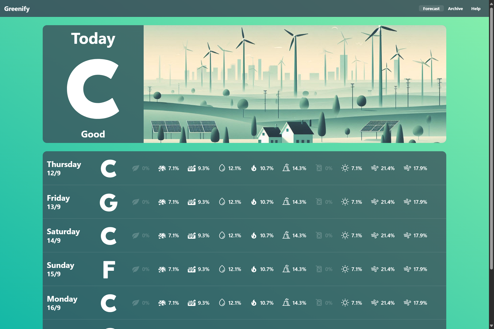
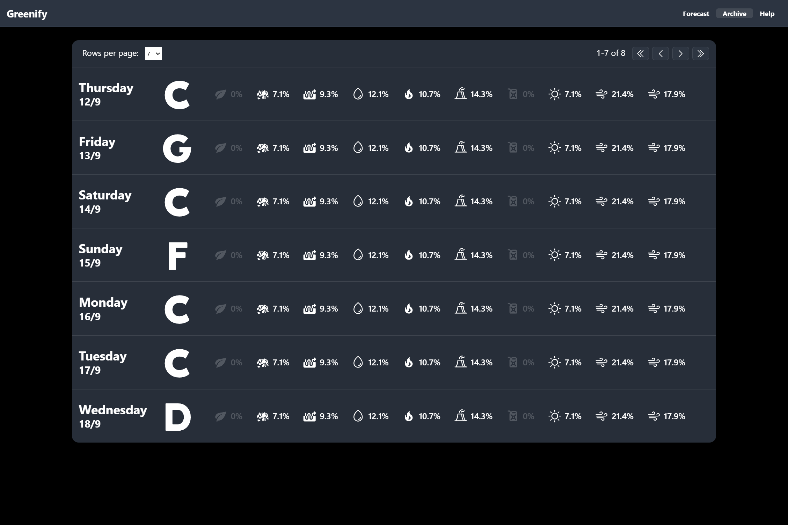
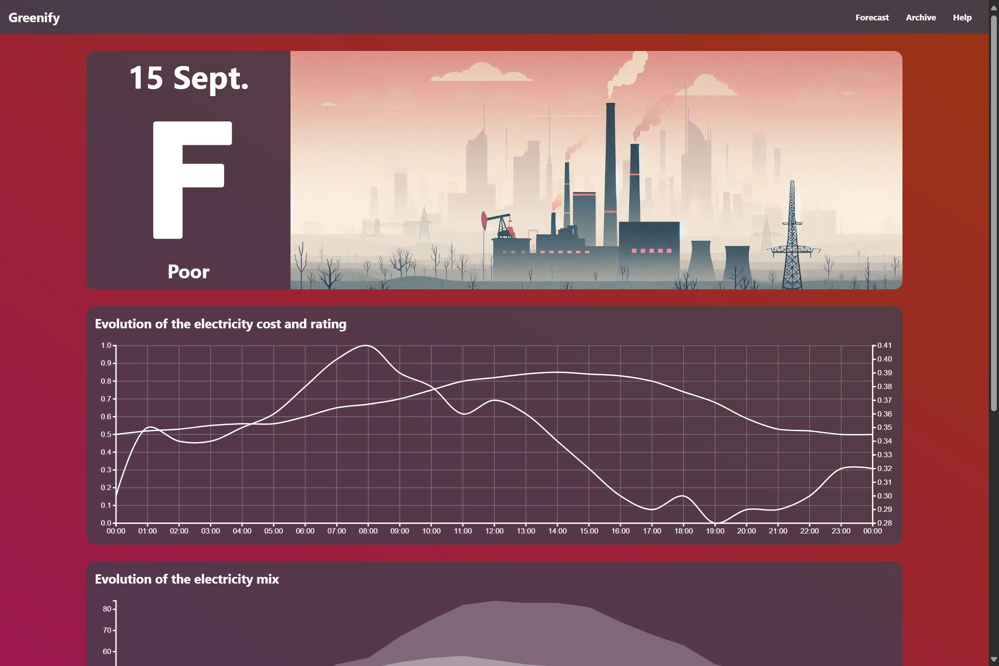
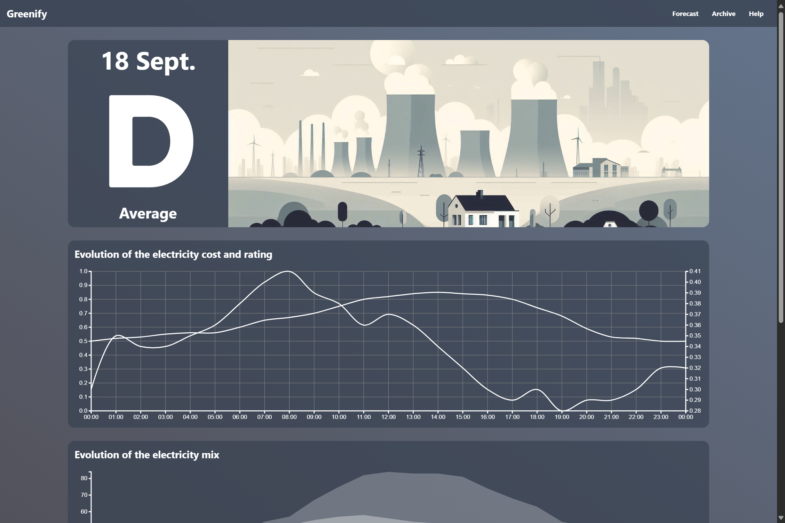
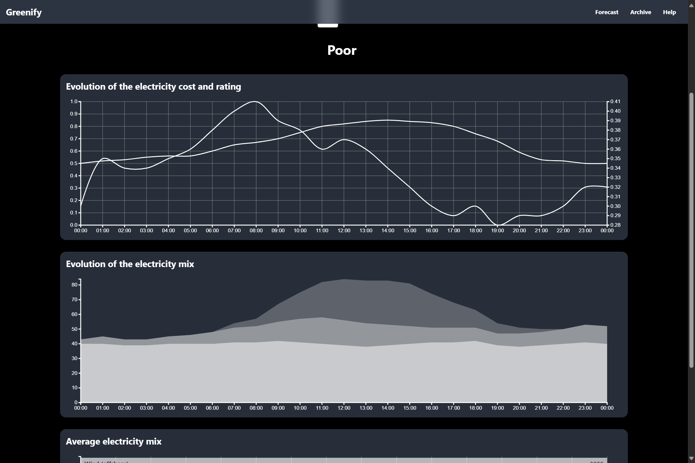
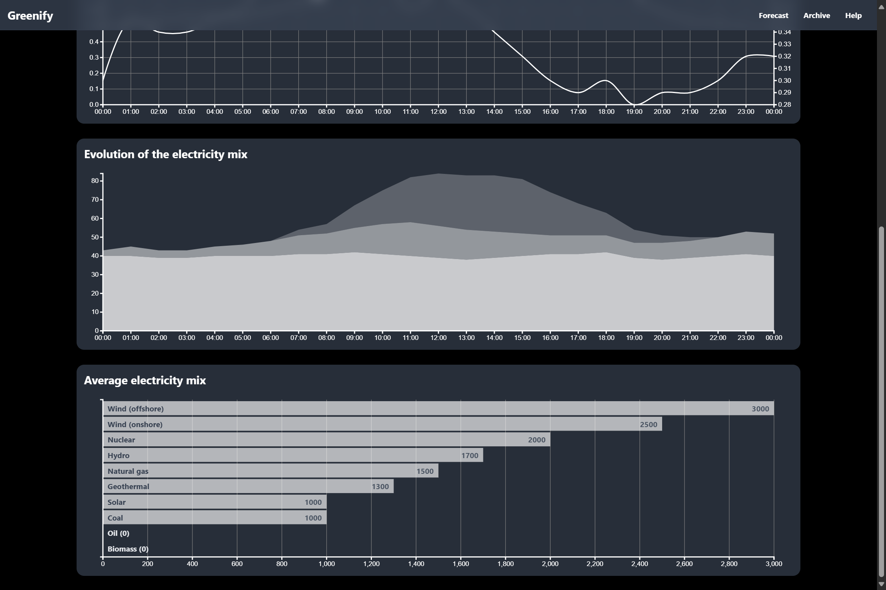

# Greenify
## Description
A web-application built with Vue.js that aims to help people consume greener electricity at lower prices.

Please note that this is an early work in progress. Data displayed in the application is randomly generated and should not be used to make decisions about your electricity usage.

## Screenshots









## How to use?
### Requirements
Node.js v22.9.0 or higher.

### Setup
1. Install the depencies with ```npm install```
2. Start the app with ```npm start```
3. The Greenify UI should be available at [http://localhost:5173/](http://localhost:5173/)


## REST API
**TODO**
